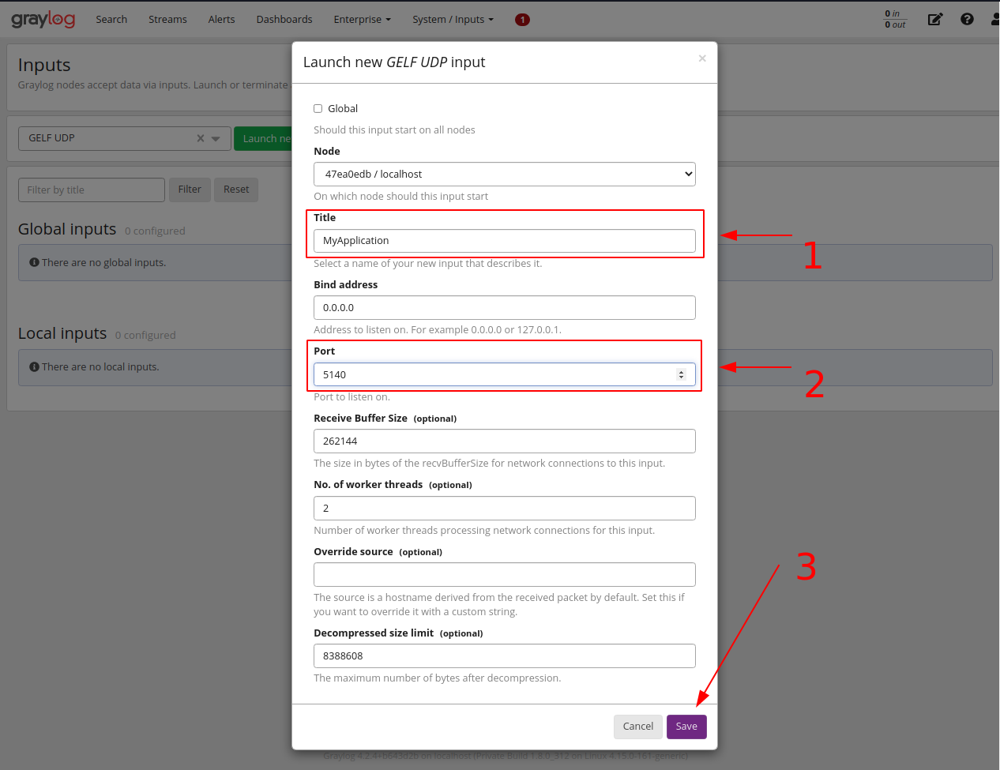

# Utilizando Graylog para centralização de logs da aplicação

Um dos principais motivos para adotar a coleta e armazenamento centralizado de logs é a necessidade de modernização dos sistemas distribuindo-os em vários serviços menores e escaláveis devido ao aumento de pessoas conectadas a internet.

Esses crescentes avanços no mundo digital causou um efeito proporcional às ameaças de ataque maliciosos em sistemas de interesse como bancos, redes sociais, e-commerces em que numa situação de investigação criminal cibernética, os logs são de fundamental valia. Outro mótivo para se ter a centralização de logs é a auditoria facilitada do histórico de atividades computacionais para resolução de problemas de forma automatizada.

O Graylog é uma solução de gerenciamento de logs centralizado para capturar, armazenar e permitir a análise em tempo real de terabytes de dados de máquina conectadas a ele.

Graylog é capaz de coletar logs segurança, logs de operações e logs de DevOps além de suportar vários tipos de integrações utilizando protocolos TCP, UDP, AMQP e tecnologias como Kafka, Serviços AWS, API REST e vários outros recursos para facilitar a coleta e análise de maneira eficiente e robusta.

Saiba mais sobre o graylog em: https://docs.graylog.org/docs/planning

## Iniciando o graylog

##### Requisitos Recomendados

- Virtualbox
- Vagrant
- 8gb RAM

Para iniciar, digite o comando abaixo em um terminal.

```bash
vagrant up
```

#### Login

A interface web foi configurada para ser acessada no endereço `http://172.30.0.200:9000`

##### Utilize estas credenciais para se autenticar no sistema

```
username: admin
password: admin
```

**obs:** ver configurações completas em `Vagrantfile`


---

#### Considerações iniciais ao dimensionar os recursos de hardware para o graylog:

1. Os nós responsáveis pelo Graylog devem ter como foco a potência da CPU. Eles também servem para a interface do usuário com o navegador.
2. Os nós responsáveis pelo Elasticsearch devem ter o máximo de RAM possível e os discos mais rápidos que você puder obter. Tudo depende da velocidade de E / S aqui.
3. Os nós responsáveis pelo MongoDB armazena metainformações e dados de configuração e não precisa de muitos recursos.
4. As mensagens de logs gerados são armazenadas apenas no Elasticsearch.

#### Arquitetura

Para este experimento, foi utilizado a configuração mínima recomendada pelo Graylog em sua documentação oficial disponibilizada em: https://docs.graylog.org/docs


##### Recursos Alocados para iniciar o servidor

```
ram: 4gb
cpus: 2
```

**obs:** ver configurações completas em `Vagrantfile`

---

## Exemplo utilizando uma aplicação Java

##### Requisitos para completar esse tutorial

- Aplicação Spring Boot
- Logback (vem por padrão em todos os spring boot starters)
- Maven

###### adicione esta depência no pom.xml:

```xml
<!-- GrayLog Integration -->
<dependency>
    <groupId>de.siegmar</groupId>
    <artifactId>logback-gelf</artifactId>
    <version>2.0.0</version>
</dependency>
```

###### crie o arquivo `logback.xml` em `src/main/resource` e adicione estas configurações:

```xml
<!-- GrayLog Integration -->
<?xml version="1.0" encoding="UTF-8" ?>

<configuration>
    <!-- ADD YOUR GRAYLOG SETTINGS HERE   -->
    <property name="GRAYLOG_ORIGIN" value="192.167.100.17" />
    <property name="GRAYLOG_HOST" value="172.30.0.200" />
    <property name="GRAYLOG_PORT" value="5140" />

    <conversionRule conversionWord="clr" converterClass="org.springframework.boot.logging.logback.ColorConverter" />
    <conversionRule conversionWord="wex" converterClass="org.springframework.boot.logging.logback.WhitespaceThrowableProxyConverter" />
    <conversionRule conversionWord="wEx" converterClass="org.springframework.boot.logging.logback.ExtendedWhitespaceThrowableProxyConverter" />

    <!-- FORMAT CONSOLE LOG   -->
    <appender name="CONSOLE_APPENDER" class="ch.qos.logback.core.ConsoleAppender">
        <encoder class="ch.qos.logback.classic.encoder.PatternLayoutEncoder">
            <pattern>${CONSOLE_LOG_PATTERN:-%clr(%d{yyyy-MM-dd HH:mm:ss.SSSX}){faint} %clr(${LOG_LEVEL_PATTERN:-%5p}) %clr(${PID:- }){magenta} %clr(---){faint} [%thread] %clr(%logger){cyan} %clr(:){faint} %m%n${LOG_EXCEPTION_CONVERSION_WORD:-%wEx}}</pattern>
            <charset>UTF-8</charset>
        </encoder>
    </appender>

    <!-- (OPTIONAL) WRITE LOGS IN TO FILE   -->
    <appender name="FILE" class="ch.qos.logback.core.FileAppender">
        <file>log/application.log</file>
        <append>true</append>
        <encoder>
            <pattern>%d{yyyy-MM-dd HH:mm:ss.SSX} [%thread] %-5level %logger{35} - %msg%n</pattern>
            <charset>UTF-8</charset>
        </encoder>
    </appender>

    <!-- GRAYLOG INTEGRATION   -->
    <appender name="GELF" class="de.siegmar.logbackgelf.GelfUdpAppender">
        <graylogHost>${GRAYLOG_HOST}</graylogHost>
        <graylogPort>${GRAYLOG_PORT}</graylogPort>
        <maxChunkSize>508</maxChunkSize>
        <useCompression>true</useCompression>

        <encoder class="de.siegmar.logbackgelf.GelfEncoder">
            <originHost>${GRAYLOG_ORIGIN}</originHost>
            <includeRawMessage>false</includeRawMessage>
            <includeMarker>true</includeMarker>
            <includeMdcData>true</includeMdcData>
            <includeCallerData>false</includeCallerData>
            <includeRootCauseData>false</includeRootCauseData>
            <includeLevelName>false</includeLevelName>

            <staticField>app_name:backend</staticField>
            <staticField>os_arch:${os.arch}</staticField>
            <staticField>os_name:${os.name}</staticField>
            <staticField>os_version:${os.version}</staticField>

            <shortPatternLayout class="ch.qos.logback.classic.PatternLayout">
                <pattern>%m%nopex</pattern>
            </shortPatternLayout>
            <fullPatternLayout class="ch.qos.logback.classic.PatternLayout">
                <pattern>%m%n</pattern>
            </fullPatternLayout>
        </encoder>
    </appender>

    <!-- APPEND SETTINGS   -->
    <root level="WARN">
        <appender-ref ref="GELF" />
        <appender-ref ref="CONSOLE_APPENDER" />

        <!-- (OPTIONAL) WRITE FILE   -->
        <appender-ref ref="FILE" />
    </root>

    <!-- ADD YOUR CUSTOM LOGS HERE  -->
    <logger level="INFO" name="org.springframework.web" />
    <logger level="DEBUG" name="org.hibernate.SQL"/>

</configuration>
```

##### Edite as propriedas

`GRAYLOG_ORIGIN` : É o endereço IP ou dominio de origem da máquina que está enviando os logs.  
`GRAYLOG_HOST` : É o endereço IP ou dominio do graylog server.  
`GRAYLOG_PORT` : É a porta de entrada por onde o graylog server foi configurado para receber os logs.

## Configuração o Graylog

Navegue até a página inputs pelo menu superior em `System/Inputs > Inputs`

1. Selecione um input do tipo `GELF UDP`
2. Clique em `Lauch new input`


<br>

Ao abrir o menu:

1. Adicione um titulo para identificar o input
2. Defina uma porta para que o graylog possa colletar os log gerados.  
   Para este exemplo foi utilizado a porta `5140`
3. Salve a configuração



<br>

O resultado deverá ser semelhante a isto. A partir daqui, o graylog já deverá estar pronto para receber informações de logs da sua aplicação.

**OBS:** Para visualizar as mensagens de logs coletadas clique em `show received messages`


<br>

Clique no botão indicado para ver as atualizações em tempo real.


<br>

A partir daqui, você já está pronto para implementar a sua própria solução de logs centralizados.
